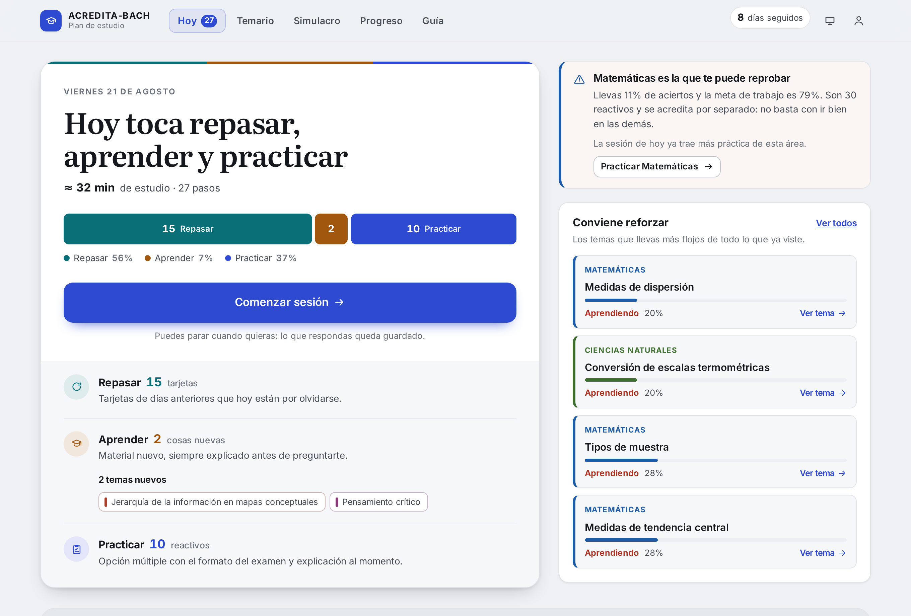
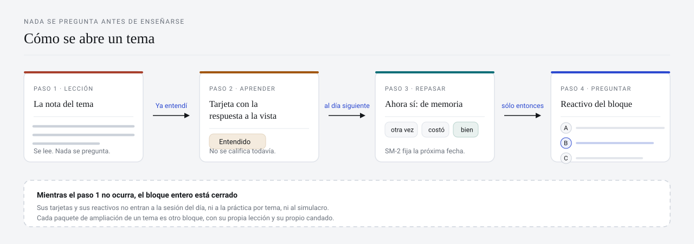
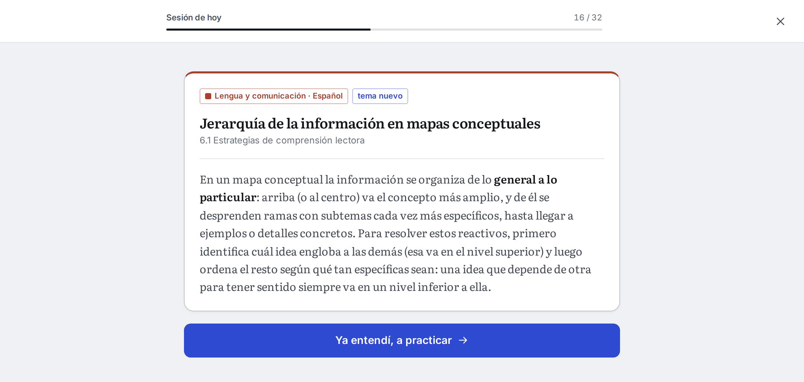
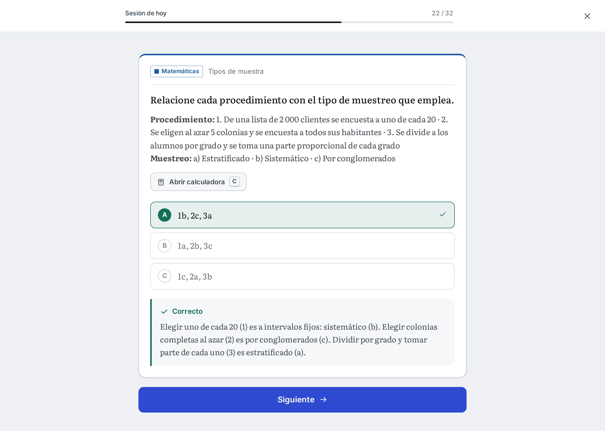
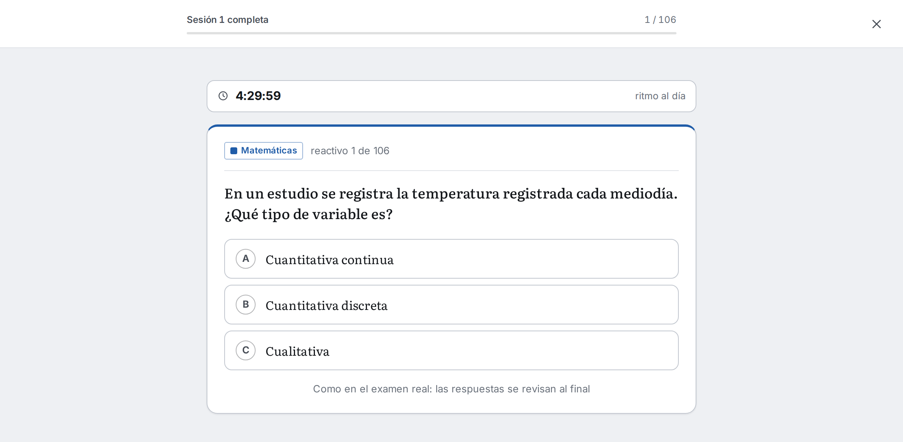
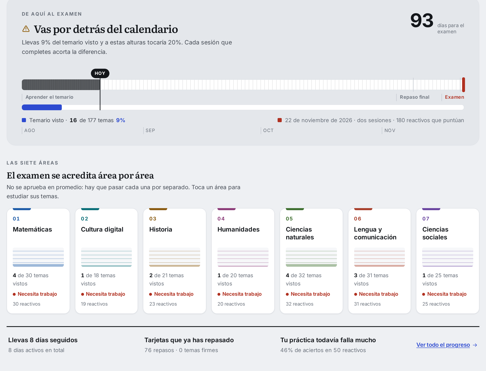

# ACREDITA-BACH · Plan de estudio

Herramienta de estudio para el **Examen para la Acreditación del Bachillerato General**
(ACREDITA-BACH, Ceneval). Toma el temario oficial completo —7 áreas, 177 temas— y lo
convierte en un plan diario: repetición espaciada, práctica con el formato del examen y
simulacros con su carga real.

Corre entera en el navegador. Sin cuenta se estudia igual: el avance se guarda en el
dispositivo. Con cuenta, vive en un servidor propio y te sigue a donde inicies sesión.



Al abrir no hay un catálogo que explorar ni un menú donde elegir: la app ya decidió qué
toca hoy, en cuánto tiempo y por qué. Lo de arriba es una jornada real de estudio de la
app corriendo en local, con ocho días de uso detrás.

---

## La regla que ordena todo lo demás

**Nada se pregunta antes de haberse enseñado.** No es una frase de producto: es una
propiedad que el motor sostiene y que las pruebas verifican en cada push.



Cada tema se divide en **bloques** (la nota base, los paquetes de ampliación, los
reactivos de formato). Un bloque cerrado no aporta nada: ni tarjetas ni reactivos entran
a la sesión del día, ni a la práctica por tema, ni al simulacro. La primera vez que una
tarjeta aparece se muestra **con la respuesta a la vista** y un solo botón; recién al día
siguiente se te pide recordarla.

| Primero se explica | Después —y sólo después— se pregunta |
| --- | --- |
|  |  |

Dos pasos consecutivos de la misma sesión. El material de estudio va en serif y la
interfaz en sans: se distingue de un vistazo qué está diciendo la app y qué es contenido
del temario.

`npm run test:motor` falla si un bloque cerrado suelta una pregunta, si una tarjeta
aparece antes que la lección de su bloque o si aprender y repasar se mezclan.
`npm run validate` falla si una tarjeta **define** un concepto que ni la nota del tema ni
la lección de su paquete explican, con el nombre del concepto en el error.

---

## Qué contiene

|  |  |
| --- | --- |
| Áreas del examen | 7, cada una se acredita por separado |
| Temas | 177 — los 177 de la *Guía para el sustentante* (Ceneval, junio 2026) |
| Tarjetas de repaso | 1 032 |
| Reactivos escritos | 1 708, siempre con tres opciones y explicación |
| Reactivos con figura | 28 (gráficas, cuadros de Punnett, iconos, obras) |
| Temas con problemas generados | 45 — números y contexto distintos en cada intento |

**Modo esencial, activado de fábrica.** No todo el banco pesa lo mismo de cara al examen:
en modo esencial el plan usa **354 tarjetas y 610 reactivos** —la nota base, los formatos
que la guía marca por nombre y el refuerzo de lo que las orientaciones nombran— y deja
fuera la ampliación de cultura general. Cambiar de modo no borra nada: las tarjetas de
ampliación conservan intervalo y repasos, y vuelven al activar el modo completo.

**Fiel a la guía oficial.** Los 177 temas coinciden uno a uno con los de la guía (mismos
identificadores, mismas subáreas, mismo reparto de reactivos por área); los 173 términos
concretos que las orientaciones nombran están cubiertos; los reactivos tienen tres
opciones —no cuatro— porque la guía indica «una respuesta correcta y dos distractores»,
y el validador lo exige.

→ [Contenido, fidelidad al temario y validaciones](docs/contenido.md)

---

## El examen que se simula

180 reactivos cuentan para la calificación, pero se contestan **205**: hay un bloque de 25
reactivos piloto que no puntúan y que el sustentante no puede distinguir. Sesión 1: 92 + 14
piloto = 106 en 4 h 30 min. Sesión 2: 88 + 11 piloto = 99 en 4 h, con receso de hora y
media. Los simulacros completos usan esa cuenta física —la que marca el ritmo por
pregunta— y descuentan el bloque piloto al calificar.



Además del simulacro completo hay repasos relámpago y sesiones adaptadas que sólo
preguntan de lo que ya estudiaste.

---

## Cómo decide qué estudiar

1. **Repaso espaciado.** Cada tarjeta lleva su propio intervalo (SM-2, el algoritmo de
   Anki, adaptado a tres botones) y sale a repaso justo cuando estás por olvidarla.
2. **Temas nuevos, entrelazados.** El plan reparte los 177 temas entre los días que
   quedan hasta el examen y mezcla áreas distintas en la misma sesión, en vez de bloques
   largos de una sola materia.
3. **El área en riesgo manda.** El examen se acredita área por área, así que la práctica
   del día se pondera por área: la que va peor recibe más turnos.

Si un día no estudias, lo pendiente se reparte solo entre los días que quedan.



El avance nunca se resume en un solo número: la regleta compara los días transcurridos
con el temario visto, y cada área lleva su propia cuenta, porque reprobar tres significa
volver a empezar.

→ [El motor: plan diario, SM-2, cómo se calcula el avance](docs/motor.md)

---

## Probarlo en local

```bash
npm install
npm run dev      # http://localhost:5173
npm run check    # validar temario + generadores + motor + build
```

No hay backend que levantar: `data/*.js` se cargan como scripts normales y todo el estado
vive en el navegador. Las cuentas son opcionales y usan un Worker de Cloudflare que cabe
en un archivo (`server/cloudflare-worker.js`).

→ [Estructura del proyecto, build y publicación](docs/desarrollo.md) ·
[Cuentas, sincronización y respaldo del progreso](docs/cuentas.md)

---

## Qué es y qué no es

- **Es** una herramienta de estudio independiente construida sobre el temario público de
  la *Guía para el sustentante ACREDITA-BACH* (Ceneval, junio de 2026).
- **No está** afiliada al Ceneval ni avalada por él, y **no puede garantizar** ningún
  resultado.
- Las explicaciones, tarjetas y reactivos **los redactó esta app**: no son material del
  Ceneval.
- Los porcentajes que muestra son una referencia de estudio, **no** el Índice Ceneval
  (700–1300 puntos, mínimo 1000 por área) ni una conversión a él.
- Fechas, costos, sedes y temario **cambian cada convocatoria**: confírmalos siempre en
  [ceneval.edu.mx](https://www.ceneval.edu.mx). Conviene usarla **junto con** las 24
  preguntas muestra de la guía oficial.
